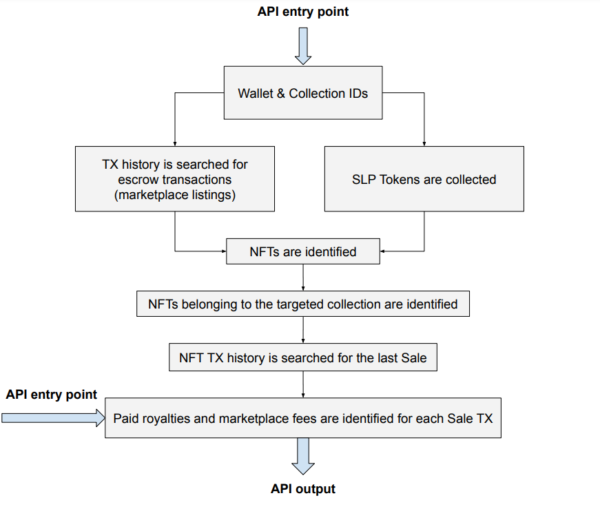

# Vistier

## Overview
Vistier is a library/API used to process Solana wallets (or transactions) 
and determine what fees were paid for the acquisition of an NFT to
both creators (royalties) and marketplace.

The API was developed as part of the 2022 **[Creator Monetization Hackathon,
Future Of Royalties](https://gitcoin.co/issue/29544)** by [Magic Eden](https://magiceden.io/).

Using Vistier, developers and communities:
- have a means of identifying holders that respected royalties,
thus allowing for a reward structure 
- have a tool of tracking paid royalties

The API is easily incorporated in any system and does not require any storage mechanism when deployed loically.
It relies solely on processing transactions and, with enough committed resources, 
can be surprisingly fast.

## Setup

TODO lib setup + server setup + docker setup + discord setup

## Architecture

### Algorithm
The algorithm for Vistier logic is shown in the following diagram



There are 2 entry points into the API that differ in input and functionality:
1. when a wallet address is provided
   - all NFTs containing in the wallet and all escrowed NFTs are collected, 
identified which belong to the targeted collection and subsequently processed for royalty payment information.
   - method: `libvistier.api_search_wallet_for_nfts`
2. when a TX is provided
   - only payment/royalty information portraying to that TX is processed and returned.
   - method `libvistier.api_process_signature`

### Output

TODO discuss output

### Examples

`libvistier.api_search_wallet_for_nfts` output for

_address_: twT9F31KYwWoCKJekKZrhk15RsUguHiqFDvXnfMKzBu 

_CMID_: 71ghWqucipW661X4ht61qvmc3xKQGMBGZxwSDmZrYQmf (Shadowy Super Coder collection )

```json
{
    "creator_fee_percent_on_sale": 5,
    "fees_on_owned_nfts": {
        "creator": 4624000000,
        "marketplace": 0,
        "total": 4624000000
    },
    "owned_nfts": {
        "4moEtbb2Uhn5RXkQBNE4Q6cgQ7FNsKuYC7d5VhgRZs1L": "Shadowy Super Coder #7044",
        "F4WhvqWGGxCKM88Sdoxw57R8sQMBeh5W8NWuKZwEL6L9": "Shadowy Super Coder #3943",
        "GDpAaSaSgWRamurA2qAm5q2RhptWTyqqQNxTbw9XWbkv": "Shadowy Super Coder #7952"
    },
    "owned_nfts_count": 3,
    "owner_address": "twT9F31KYwWoCKJekKZrhk15RsUguHiqFDvXnfMKzBu",
    "transactions": [
        {
            "block_time": 1668283175,
            "buyer": "twT9F31KYwWoCKJekKZrhk15RsUguHiqFDvXnfMKzBu",
            "creator_fee_paid": 1599000000,
            "market_fee_paid": 0,
            "mint": "4moEtbb2Uhn5RXkQBNE4Q6cgQ7FNsKuYC7d5VhgRZs1L",
            "name": "Shadowy Super Coder #7044",
            "price": 31980000000,
            "seller": "1BWutmTvYPwDtmw9abTkS4Ssr8no61spGAvW1X6NDix",
            "signature": "3zzfdKubCUYNvH8DmAoWA4jDAAqYrTviXyz8tnLHeWGr5BXS698NF8NX7PxuuMzEVTFNX2imdWGxaDvLm7dTsghJ",
            "source": "MagicEden",
            "type": "Sale"
        },
        {
            "block_time": 1668283175,
            "buyer": "twT9F31KYwWoCKJekKZrhk15RsUguHiqFDvXnfMKzBu",
            "creator_fee_paid": 1500000000,
            "market_fee_paid": 0,
            "mint": "F4WhvqWGGxCKM88Sdoxw57R8sQMBeh5W8NWuKZwEL6L9",
            "name": "Shadowy Super Coder #3943",
            "price": 30000000000,
            "seller": "1BWutmTvYPwDtmw9abTkS4Ssr8no61spGAvW1X6NDix",
            "signature": "5qnYngx4Tk5fgMTbXAADYM9Tx1SbyfV7ptdYa31c3GTQd7aZzkDrgyep77Yb8dhxBKvkqhSwuumJcUKMM49Hh6L5",
            "source": "MagicEden",
            "type": "Sale"
        },
        {
            "block_time": 1668283175,
            "buyer": "twT9F31KYwWoCKJekKZrhk15RsUguHiqFDvXnfMKzBu",
            "creator_fee_paid": 1525000000,
            "market_fee_paid": 0,
            "mint": "GDpAaSaSgWRamurA2qAm5q2RhptWTyqqQNxTbw9XWbkv",
            "name": "Shadowy Super Coder #7952",
            "price": 30500000000,
            "seller": "1BWutmTvYPwDtmw9abTkS4Ssr8no61spGAvW1X6NDix",
            "signature": "4BTH7Ff5zJNbiwFrsZhzQhaUjZ4pwsV185dDiWgnUYcaLRGrSEB4JcLaQPmMnmVLgPy5pPWzFto4hQXAbsyTaARL",
            "source": "MagicEden",
            "type": "Sale"
        }
    ]
}
```

`libvistier.api_process_signature` output for TX __5viR6rqH2CEieDQMEk11JcNN18R5vnhg8iAL8zH4SwNFvx93ik243aTyYQRQUhAs8HnfrcfBRzrt3wFKtxCaTWWW__
```json
{
    "block_time": 1648153058,
    "buyer": "efmNnD49nYvpAUoaz9Jadzrz14Xw1cauVSJhquhJpLE",
    "creator_fee_paid": 0,
    "market_fee_paid": 1499800000,
    "mint": "F4WhvqWGGxCKM88Sdoxw57R8sQMBeh5W8NWuKZwEL6L9",
    "name": "Shadowy Super Coder #3943",
    "price": 74990000000,
    "seller": "1BWutmTvYPwDtmw9abTkS4Ssr8no61spGAvW1X6NDix",
    "signature": "5viR6rqH2CEieDQMEk11JcNN18R5vnhg8iAL8zH4SwNFvx93ik243aTyYQRQUhAs8HnfrcfBRzrt3wFKtxCaTWWW",
    "source": "MagicEden",
    "type": "Sale"
}
```


