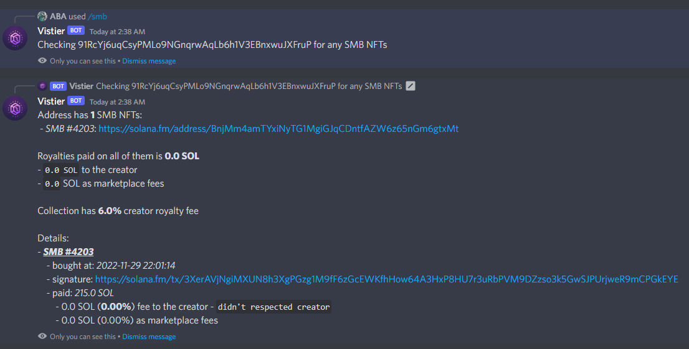

# Vistier Discord Bot
You can also see these messages directly in the RabbitMQ interface if management plugin is added.

##Description

A POC bot that queries Vistier API to showcase it's utility.
Supports 3 commands all which receive a Solana address as input:


As it is, it tries to connect to *Visiter API* on localhost using the 5000 port.
Change the following variables to your production server if needed

``
VISTIER_API_URL = "http://127.0.0.1"
VISTIER_API_PORT = 5000
``

Bot can be easely extended to provide any gating via royalties paid or other fee related option.

###Discord description
```POC (Prof of concept) bot that helps by querying Vistier API in order to find if a given address has specific NFTs and how much royalty they paid for it.```


##Setup

1. Create the discord application bot. Search online for good resources
2. Install dependencies
```
pip install requirements.txt
```
3. Modify the *VISTIER_API_URL* and *VISTIER_API_PORT* to point to your target server
4. Launch _vistibot.py_

##Bot required permissions
For easy debug/development the following are recommended:
- General Permissions
    - Read Messages/View Channels
- Text Permissions
    - Send Messages
    - Create Public Threads
    - Create Private Threads
    - Send Messages in Threads
    - Manage Messages
    - Manage Threads
    - Embed Links
    - Attach Files
    - Read Message History
    - Mention Everyone
    - Use External Emojis
    - Use External Stickers
    - Add Reactions
    - Use Slash Commands

Bot add URL: https://discord.com/api/oauth2/authorize?client_id=1043535437240729651&permissions=534723947584&scope=bot

#Examples


